# cctg — Claude Code Telegram Gate

Approve or deny Claude Code's tool calls from your phone via Telegram.

When Claude Code wants to run a command, edit a file, or use any tool, cctg sends a permission request to your Telegram bot. You tap **Allow** or **Deny** — and Claude proceeds (or doesn't).


## How it works

cctg is a [PreToolUse hook](https://docs.claude.com/en/docs/claude-code/hooks) for Claude Code. Each time Claude wants to use a tool:

```mermaid
flowchart TD
    A[Tool call] --> B{cctg active?}
    B -- No --> C[Pass through<br/>Normal CLI prompts]
    B -- Yes --> D{In settings.json<br/>allow list?}
    D -- Yes --> C
    D -- No --> E{In cctg<br/>autoApprove?}
    E -- Yes --> F[Allow silently]
    E -- No --> G{In cctg<br/>autoDeny?}
    G -- Yes --> H[Deny silently]
    G -- No --> I[Send to Telegram]
    I --> J{User taps}
    J -- Allow --> K[Allow + update msg]
    J -- Deny --> L[Deny + update msg]
    J -- Timeout --> L

    style C fill:#2d4a2d
    style F fill:#2d4a2d
    style K fill:#2d4a2d
    style H fill:#4a2d2d
    style L fill:#4a2d2d
```



No daemon. No background process. No external dependencies beyond Node.js.

## Install

```bash
npm install -g cctg
```

## Setup

### 1. Create a Telegram bot

1. Open [@BotFather](https://t.me/BotFather) on Telegram
2. Send `/newbot` and follow the prompts
3. Copy the bot token

### 2. Get your chat ID

1. Open [@userinfobot](https://t.me/userinfobot) on Telegram
2. Send any message — it replies with your user ID

### 3. Run the setup wizard

```bash
cctg init
```

It will ask for your bot token and chat ID, then automatically register the hook in `~/.claude/settings.json`.

## Usage

### Toggle Telegram approval

```bash
cctg on       # Enable — going AFK, approve from phone
cctg off      # Disable — back at keyboard, normal CLI prompts
cctg status   # Show current mode
```

### AFK workflow

```bash
# Starting a long task, stepping away
cctg on
claude "refactor the auth module"
# Approve/deny tool calls from your phone while away

# Back at keyboard
cctg off
# Tool calls now use normal CLI prompts again
```

### Permission-aware filtering

cctg reads your `~/.claude/settings.json` permission rules. Tools already in your `permissions.allow` list pass through silently — only unlisted tools trigger Telegram prompts.

This means you won't get spammed with Telegram messages for every `Read`, `Glob`, or `git status` call. Only tools that would normally prompt you in the CLI get sent to Telegram.

## Configuration

Config lives at `~/.cctg.json`:

```json
{
  "botToken": "123456:ABC-DEF...",
  "chatId": "987654321",
  "timeoutSeconds": 300,
  "autoApprove": [],
  "autoDeny": []
}
```

| Field | Description | Default |
|---|---|---|
| `botToken` | Telegram bot token from @BotFather | required |
| `chatId` | Your Telegram user ID | required |
| `timeoutSeconds` | Seconds to wait before auto-denying | `300` |
| `autoApprove` | Tool names to silently allow (bypasses Telegram) | `[]` |
| `autoDeny` | Tool names to silently deny | `[]` |

## Security

- **Fail-closed** — if anything goes wrong (timeout, network error, crash), the tool call is denied
- **Chat ID verification** — only responses from your configured Telegram user ID are accepted
- **Request ID matching** — each permission request has a unique ID, preventing replay attacks
- **No secrets in code** — bot token and chat ID live in `~/.cctg.json`, never in the repo
- **Polling mode** — no webhook server, no public URL, no ngrok needed

## License

MIT
