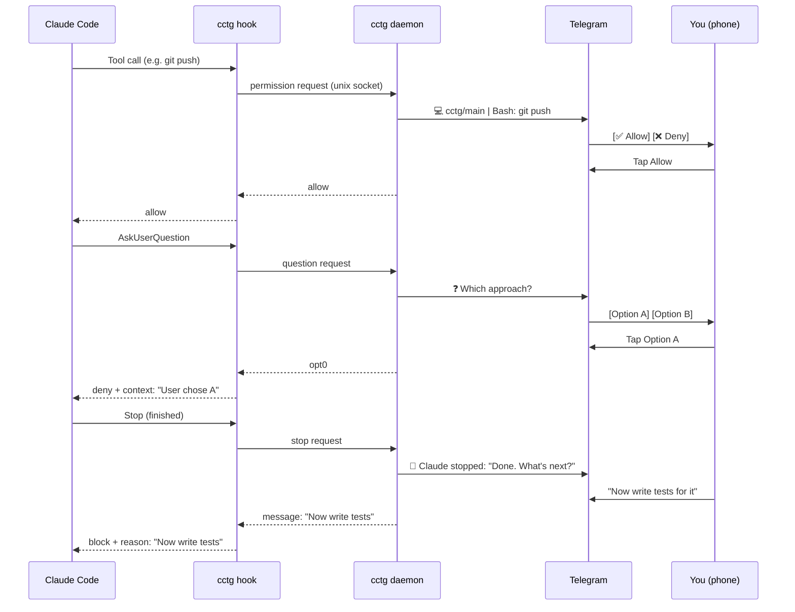

<div align="center">

# cctg

**Claude Code Telegram Gate**

Control Claude Code from your phone via Telegram — approve tool calls, answer questions, and send follow-up instructions.

[](https://www.npmjs.com/package/cctg)
[](LICENSE)
[](https://nodejs.org)
[](#)

</div>

---

Start a task, walk away, and keep steering Claude from your phone. cctg hooks into Claude Code's event system to give you full remote control:

- **Tool approvals** — approve or deny commands, file edits, and other tool calls
- **Question answering** — when Claude asks a clarifying question, pick an option from Telegram
- **Continuation** — when Claude finishes, send your next instruction from Telegram


```mermaid
sequenceDiagram
    participant C as Claude Code
    participant H as cctg hook
    participant D as cctg daemon
    participant T as Telegram
    participant U as You (phone)

    C->>H: Tool call (e.g. git push)
    H->>D: permission request (unix socket)
    D->>T: 💻 cctg/main | Bash: git push
    T->>U: [✅ Allow] [❌ Deny]
    U->>T: Tap Allow
    D-->>H: allow
    H-->>C: allow

    C->>H: AskUserQuestion
    H->>D: question request
    D->>T: ❓ Which approach?
    T->>U: [Option A] [Option B]
    U->>T: Tap Option A
    D-->>H: opt0
    H-->>C: deny + context: "User chose A"

    C->>H: Stop (finished)
    H->>D: stop request
    D->>T: 🤖 Claude stopped: "Done. What's next?"
    U->>T: "Now write tests for it"
    D-->>H: message: "Now write tests"
    H-->>C: block + reason: "Now write tests"
```

### Contents

- [Features](#features) · [Demo](#demo) · [Quick Start](#quick-start) · [Usage](#usage)
- [How It Works](#how-it-works) · [Configuration](#configuration) · [Security](#security) · [Troubleshooting](#troubleshooting)

---

## Features

- **Three modes** — `cctg on` (full remote), `cctg tools-only` (approvals only), `cctg off`
- **Remote continuation** — when Claude stops, send your next instruction from Telegram
- **Question interception** — AskUserQuestion prompts forwarded to Telegram with option buttons
- **Permission-aware** — reads your `~/.claude/settings.json` allow list; only prompts for tools that would normally require approval
- **Fail-closed** — timeout, crash, or network error = denied (tool calls) or pass-through (stop hook)
- **Anti-replay** — each request has a unique ID; stale button presses are ignored
- **Zero dependencies** — pure Node.js, no external packages
- **Lightweight daemon** — auto-managed background process; starts with `cctg on`, stops with `cctg off`
- **Multi-session** — run multiple Claude Code sessions with one Telegram bot

---

## Demo

**Tool approval** — when Claude tries to run an unapproved tool:

```
💻 Bash
────────────────────
git push origin main

[✅ Allow]  [❌ Deny]
```

**Question answering** — when Claude asks a clarifying question:

```
❓ Claude is asking
────────────────────
Which approach do you prefer?

  1. Option A — Simple and fast
  2. Option B — More thorough

[Option A]  [Option B]
```

**Remote continuation** — when Claude finishes and is waiting:

```
🤖 Claude stopped
────────────────────
Done! I've refactored the auth module
and updated the tests.

Reply to continue · /done to stop
```

Reply with your next instruction, or `/done` to let Claude stop.

---

## Prerequisites

- **Node.js 18+** (Claude Code already requires this)
- **Telegram account** with a bot (free, takes 2 minutes)

---

## Quick Start

### 1. Install

```bash
npm install -g cctg
```

Or clone and build from source:

```bash
git clone https://github.com/laveez/cctg.git
cd cctg && npm install && npm run build
```

### 2. Create a Telegram bot

1. Open [@BotFather](https://t.me/BotFather) on Telegram
2. Send `/newbot` and follow the prompts
3. Copy the bot token

### 3. Get your chat ID

1. Open [@userinfobot](https://t.me/userinfobot) on Telegram
2. Send any message — it replies with your user ID

### 4. Run setup

```bash
cctg init
```

Enter your bot token and chat ID. The wizard writes `~/.cctg.json` and registers the hook in `~/.claude/settings.json`.

---

## Usage

### Modes

```bash
cctg on          # Full remote — tools, questions, and continuation via Telegram
cctg tools-only  # Tool approvals only — questions and input at terminal
cctg off         # Disabled — normal CLI prompts
cctg status      # Show current mode
```

### AFK workflow

```bash
cctg on
claude "refactor the auth module"
# Approve tools, answer questions, send follow-ups — all from your phone

# Back at keyboard
cctg tools-only  # or: cctg off
# Terminal input again. If Claude was waiting, it resumes.
```

### Permission-aware filtering

cctg reads your `~/.claude/settings.json` permission rules. Tools already in your `permissions.allow` list pass through silently — only unlisted tools trigger Telegram prompts.

This means you won't get spammed with messages for every `Read`, `Glob`, or `git status` call.

---

## How it works

cctg runs a lightweight daemon and registers two [Claude Code hooks](https://code.claude.com/docs/en/hooks):

- **PreToolUse** — intercepts tool calls and AskUserQuestion prompts
- **Stop** — intercepts when Claude finishes, enabling remote continuation

Hooks connect to the daemon via Unix socket. The daemon maintains a single Telegram Bot API connection shared across all sessions.


```mermaid
flowchart TD
    A[Tool call] --> B{Mode?}
    B -- off --> C[Pass through]
    B -- on / tools-only --> D{Already permitted?}
    D -- Yes --> C
    D -- No --> E{AskUserQuestion<br/>+ mode = on?}
    E -- Yes --> F[Send question<br/>to daemon]
    F --> G[Daemon forwards to Telegram]
    G --> H[User picks option]
    H --> I[Deny + inject answer<br/>as context]
    E -- No --> J[Send to daemon<br/>Allow / Deny request]
    J --> K[Daemon forwards to Telegram]
    K --> L{User taps}
    L -- Allow --> M[Allow]
    L -- Deny/Timeout --> N[Deny]

    O[Claude stops] --> P{Mode = on?}
    P -- No --> Q[Pass through]
    P -- Yes --> R[Send to daemon]
    R --> S[Daemon forwards<br/>to Telegram]
    S --> T{User response}
    T -- Text reply --> U[Block stop +<br/>continue with instruction]
    T -- /done --> Q
    T -- Timeout --> Q
    T -- Mode changed --> Q

    style C fill:#2d4a2d
    style M fill:#2d4a2d
    style I fill:#2d4a2d
    style U fill:#2d4a2d
    style N fill:#4a2d2d
    style Q fill:#2d4a2d
```

A lightweight daemon process manages all Telegram communication. When you run `cctg on`, the daemon starts automatically and maintains a single connection to the Telegram Bot API. Hook processes connect to the daemon via Unix socket, send requests, and receive responses. This architecture supports multiple concurrent Claude Code sessions without conflicts.

---

## Configuration

Config lives at `~/.cctg.json` (created by `cctg init`):

```json
{
  "botToken": "123456:ABC-DEF...",
  "chatId": "987654321",
  "timeoutSeconds": 300,
  "remoteTimeoutSeconds": 300,
  "autoApprove": [],
  "autoDeny": []
}
```

| Field | Description | Default |
|---|---|---|
| `botToken` | Telegram bot token from @BotFather | required |
| `chatId` | Your Telegram user ID | required |
| `timeoutSeconds` | Seconds to wait for tool approval before auto-denying | `300` |
| `remoteTimeoutSeconds` | Seconds to wait for continuation input (Stop hook) | `timeoutSeconds` |
| `autoApprove` | Tool names to silently allow (bypasses Telegram) | `[]` |
| `autoDeny` | Tool names to silently deny | `[]` |

> **Note:** `autoApprove` / `autoDeny` in `~/.cctg.json` are for tools you want cctg to handle directly — separate from the `permissions.allow` list in `~/.claude/settings.json`, which cctg respects automatically.

---

## Security

- **Fail-closed** — if anything goes wrong (timeout, network error, crash), the tool call is denied
- **Chat ID verification** — only responses from your configured Telegram user ID are accepted
- **Request ID matching** — each permission request has a unique ID, preventing stale button presses from being accepted
- **No secrets in code** — bot token and chat ID live in `~/.cctg.json`, gitignored
- **Local daemon** — Unix socket communication; no webhook server, no public URL, no inbound network connections

---

## Troubleshooting

**Bot not responding to button taps**

- Ensure you sent `/start` to your bot in Telegram before using it
- Verify your chat ID matches: send a message to [@userinfobot](https://t.me/userinfobot)
- Check that `~/.cctg.json` has the correct `botToken` and `chatId`

**Tool calls not going to Telegram**

- Run `cctg status` to verify cctg is on
- Check that the tool isn't already in your `~/.claude/settings.json` `permissions.allow` list (those pass through by design)

**Timeout / auto-deny too fast**

- Increase `timeoutSeconds` in `~/.cctg.json` (default is 300 = 5 minutes)
- For the Stop hook, set `remoteTimeoutSeconds` separately if needed
- The hook timeout in `~/.claude/settings.json` should be higher than your timeout values (set automatically by `cctg init`)

**Terminal frozen (remote mode)**

- This is expected when `cctg on` — the Stop hook is waiting for your Telegram response
- To take back control: open another terminal and run `cctg tools-only` or `cctg off`
- The Stop hook detects the mode change and releases the terminal

**Daemon not starting**

- Run `cctg status` — if daemon shows "not running" but mode is ON, try `cctg off && cctg on` to restart
- Check `/tmp/cctg-daemon.log` for error messages
- Verify `/tmp/cctg.sock` doesn't exist from a stale process: `rm /tmp/cctg.sock` then `cctg on`

**Multiple sessions**

- Multiple Claude Code sessions are supported — the daemon routes each request independently
- Each Telegram message shows which session (repo/branch) is making the request

---

## See Also

- **[ccsl](https://github.com/laveez/ccsl)** — Claude Code Statusline. A rich, information-dense statusline for Claude Code. When cctg is installed, ccsl shows the current cctg mode (`📱 ON` / `📱 off`) as a badge in your statusline.

---

## Contributing

Contributions are welcome! This is a small project — open an issue or submit a PR.

```bash
git clone https://github.com/laveez/cctg.git
cd cctg
npm install
npm run dev    # Watch mode — rebuilds on change
```

## License

[MIT](LICENSE)
