<div align="center">

# cctg

**Claude Code Telegram Gate**

Approve or deny Claude Code's tool calls from your phone via Telegram.

[](LICENSE)
[](https://nodejs.org)
[](#)

</div>

---

When Claude Code wants to run a command, edit a file, or use any tool — cctg intercepts it and sends a permission request to your Telegram bot. You tap **Allow** or **Deny** on your phone, and Claude proceeds (or doesn't).

```mermaid
sequenceDiagram
    participant C as Claude Code
    participant H as cctg hook
    participant T as Telegram
    participant U as You (phone)

    C->>H: Tool call (e.g. git push)
    H->>H: Active? Already permitted?

    alt Already permitted
        H-->>C: Pass through
    else Needs approval
        H->>T: Send message with buttons
        T->>U: 💻 Bash: git push<br/>[✅ Allow] [❌ Deny]
        U->>T: Tap Allow
        T->>H: Callback: allow
        H->>T: Update message: ✅ Allowed
        H-->>C: allow
    end
```



## Features

- **On/off toggle** — `cctg on` when going AFK, `cctg off` when back at keyboard
- **Permission-aware** — reads your `~/.claude/settings.json` allow list; only prompts for tools that would normally require approval
- **Fail-closed** — timeout, crash, or network error = denied
- **Anti-replay** — each request has a unique ID; stale button presses are ignored
- **Zero dependencies** — pure Node.js, no external packages
- **No daemon** — each hook invocation is a fresh process; no background services

## Demo

When Claude tries to run an unapproved tool, you get a Telegram message like this:

```
💻 Bash
────────────────────
git push origin main

[✅ Allow]  [❌ Deny]
```

Tap a button. Claude continues (or stops). The message updates to show your decision:

```
💻 Bash
────────────────────
git push origin main

✅ Allowed
```

## Prerequisites

- **Node.js 18+** (Claude Code already requires this)
- **Telegram account** with a bot (free, takes 2 minutes)

## Quick Start

### 1. Install

```bash
npm install -g cctg
```

Or clone and build from source:

```bash
git clone https://github.com/laveez/cctg.git
cd cctg && npm install && npm run build
```

### 2. Create a Telegram bot

1. Open [@BotFather](https://t.me/BotFather) on Telegram
2. Send `/newbot` and follow the prompts
3. Copy the bot token

### 3. Get your chat ID

1. Open [@userinfobot](https://t.me/userinfobot) on Telegram
2. Send any message — it replies with your user ID

### 4. Run setup

```bash
cctg init
```

Enter your bot token and chat ID. The wizard writes `~/.cctg.json` and registers the hook in `~/.claude/settings.json`.

## Usage

### Toggle approval mode

```bash
cctg on       # Enable — going AFK, approve from phone
cctg off      # Disable — back at keyboard, normal CLI prompts
cctg status   # Show current mode
```

### AFK workflow

```bash
cctg on
claude "refactor the auth module"
# Approve/deny from your phone while away

# Back at keyboard
cctg off
# Normal CLI prompts again
```

### Permission-aware filtering

cctg reads your `~/.claude/settings.json` permission rules. Tools already in your `permissions.allow` list pass through silently — only unlisted tools trigger Telegram prompts.

This means you won't get spammed with messages for every `Read`, `Glob`, or `git status` call.

## How it works

cctg is a [PreToolUse hook](https://docs.claude.com/en/docs/claude-code/hooks) — a script that Claude Code runs before every tool call.


No daemon. No background process. Each hook invocation is a fresh Node.js process that exits after the decision.

## Configuration

Config lives at `~/.cctg.json` (created by `cctg init`):

```json
{
  "botToken": "123456:ABC-DEF...",
  "chatId": "987654321",
  "timeoutSeconds": 300,
  "autoApprove": [],
  "autoDeny": []
}
```

| Field | Description | Default |
|---|---|---|
| `botToken` | Telegram bot token from @BotFather | required |
| `chatId` | Your Telegram user ID | required |
| `timeoutSeconds` | Seconds to wait before auto-denying | `300` |
| `autoApprove` | Tool names to silently allow (bypasses Telegram) | `[]` |
| `autoDeny` | Tool names to silently deny | `[]` |

> **Note:** `autoApprove` / `autoDeny` in `~/.cctg.json` are for tools you want cctg to handle directly — separate from the `permissions.allow` list in `~/.claude/settings.json`, which cctg respects automatically.

## Security

- **Fail-closed** — if anything goes wrong (timeout, network error, crash), the tool call is denied
- **Chat ID verification** — only responses from your configured Telegram user ID are accepted
- **Request ID matching** — each permission request has a unique ID, preventing stale button presses from being accepted
- **No secrets in code** — bot token and chat ID live in `~/.cctg.json`, gitignored
- **Polling mode** — no webhook server, no public URL, no inbound connections

## Troubleshooting

**Bot not responding to button taps**

- Ensure you sent `/start` to your bot in Telegram before using it
- Verify your chat ID matches: send a message to [@userinfobot](https://t.me/userinfobot)
- Check that `~/.cctg.json` has the correct `botToken` and `chatId`

**Tool calls not going to Telegram**

- Run `cctg status` to verify cctg is on
- Check that the tool isn't already in your `~/.claude/settings.json` `permissions.allow` list (those pass through by design)

**Timeout / auto-deny too fast**

- Increase `timeoutSeconds` in `~/.cctg.json` (default is 300 = 5 minutes)
- The hook timeout in `~/.claude/settings.json` should be higher than `timeoutSeconds` (set automatically by `cctg init`)

## Contributing

Contributions are welcome! This is a small project — open an issue or submit a PR.

```bash
git clone https://github.com/laveez/cctg.git
cd cctg
npm install
npm run dev    # Watch mode — rebuilds on change
```

## License

[MIT](LICENSE)
