<div align="center">

# cctg

**Claude Code Telegram Gate**

Control Claude Code from your phone via Telegram — approve tool calls, answer questions, and send follow-up instructions.

[](LICENSE)
[](https://nodejs.org)
[](#)

</div>

---

Start a task, walk away, and keep steering Claude from your phone. cctg hooks into Claude Code's event system to give you full remote control:

- **Tool approvals** — approve or deny commands, file edits, and other tool calls
- **Question answering** — when Claude asks a clarifying question, pick an option from Telegram
- **Continuation** — when Claude finishes, send your next instruction from Telegram

```mermaid
sequenceDiagram
    participant C as Claude Code
    participant H as cctg hooks
    participant T as Telegram
    participant U as You (phone)

    C->>H: Tool call (e.g. git push)
    H->>T: 💻 Bash: git push
    T->>U: [✅ Allow] [❌ Deny]
    U->>T: Tap Allow
    H-->>C: allow

    C->>H: AskUserQuestion
    H->>T: ❓ Which approach?
    T->>U: [Option A] [Option B]
    U->>T: Tap Option A
    H-->>C: deny + context: "User chose A"

    C->>H: Stop (finished)
    H->>T: 🤖 Claude stopped: "Done. What's next?"
    U->>T: "Now write tests for it"
    H-->>C: block + reason: "Now write tests"
```



## Features

- **Three modes** — `cctg on` (full remote), `cctg tools-only` (approvals only), `cctg off`
- **Remote continuation** — when Claude stops, send your next instruction from Telegram
- **Question interception** — AskUserQuestion prompts forwarded to Telegram with option buttons
- **Permission-aware** — reads your `~/.claude/settings.json` allow list; only prompts for tools that would normally require approval
- **Fail-closed** — timeout, crash, or network error = denied (tool calls) or pass-through (stop hook)
- **Anti-replay** — each request has a unique ID; stale button presses are ignored
- **Zero dependencies** — pure Node.js, no external packages
- **No daemon** — each hook invocation is a fresh process; no background services

## Demo

**Tool approval** — when Claude tries to run an unapproved tool:

```
💻 Bash
────────────────────
git push origin main

[✅ Allow]  [❌ Deny]
```

**Question answering** — when Claude asks a clarifying question:

```
❓ Claude is asking
────────────────────
Which approach do you prefer?

  1. Option A — Simple and fast
  2. Option B — More thorough

[Option A]  [Option B]
```

**Remote continuation** — when Claude finishes and is waiting:

```
🤖 Claude stopped
────────────────────
Done! I've refactored the auth module
and updated the tests.

Reply to continue · /done to stop
```

Reply with your next instruction, or `/done` to let Claude stop.

## Prerequisites

- **Node.js 18+** (Claude Code already requires this)
- **Telegram account** with a bot (free, takes 2 minutes)

## Quick Start

### 1. Install

```bash
npm install -g cctg
```

Or clone and build from source:

```bash
git clone https://github.com/laveez/cctg.git
cd cctg && npm install && npm run build
```

### 2. Create a Telegram bot

1. Open [@BotFather](https://t.me/BotFather) on Telegram
2. Send `/newbot` and follow the prompts
3. Copy the bot token

### 3. Get your chat ID

1. Open [@userinfobot](https://t.me/userinfobot) on Telegram
2. Send any message — it replies with your user ID

### 4. Run setup

```bash
cctg init
```

Enter your bot token and chat ID. The wizard writes `~/.cctg.json` and registers the hook in `~/.claude/settings.json`.

## Usage

### Modes

```bash
cctg on          # Full remote — tools, questions, and continuation via Telegram
cctg tools-only  # Tool approvals only — questions and input at terminal
cctg off         # Disabled — normal CLI prompts
cctg status      # Show current mode
```

### AFK workflow

```bash
cctg on
claude "refactor the auth module"
# Approve tools, answer questions, send follow-ups — all from your phone

# Back at keyboard
cctg tools-only  # or: cctg off
# Terminal input again. If Claude was waiting, it resumes.
```

### Permission-aware filtering

cctg reads your `~/.claude/settings.json` permission rules. Tools already in your `permissions.allow` list pass through silently — only unlisted tools trigger Telegram prompts.

This means you won't get spammed with messages for every `Read`, `Glob`, or `git status` call.

## How it works

cctg registers two [Claude Code hooks](https://docs.claude.com/en/docs/claude-code/hooks):

- **PreToolUse** — intercepts tool calls and AskUserQuestion prompts
- **Stop** — intercepts when Claude finishes, enabling remote continuation


No daemon. No background process. Each hook invocation is a fresh Node.js process that exits after the decision.

## Configuration

Config lives at `~/.cctg.json` (created by `cctg init`):

```json
{
  "botToken": "123456:ABC-DEF...",
  "chatId": "987654321",
  "timeoutSeconds": 300,
  "remoteTimeoutSeconds": 300,
  "autoApprove": [],
  "autoDeny": []
}
```

| Field | Description | Default |
|---|---|---|
| `botToken` | Telegram bot token from @BotFather | required |
| `chatId` | Your Telegram user ID | required |
| `timeoutSeconds` | Seconds to wait for tool approval before auto-denying | `300` |
| `remoteTimeoutSeconds` | Seconds to wait for continuation input (Stop hook) | `timeoutSeconds` |
| `autoApprove` | Tool names to silently allow (bypasses Telegram) | `[]` |
| `autoDeny` | Tool names to silently deny | `[]` |

> **Note:** `autoApprove` / `autoDeny` in `~/.cctg.json` are for tools you want cctg to handle directly — separate from the `permissions.allow` list in `~/.claude/settings.json`, which cctg respects automatically.

## Security

- **Fail-closed** — if anything goes wrong (timeout, network error, crash), the tool call is denied
- **Chat ID verification** — only responses from your configured Telegram user ID are accepted
- **Request ID matching** — each permission request has a unique ID, preventing stale button presses from being accepted
- **No secrets in code** — bot token and chat ID live in `~/.cctg.json`, gitignored
- **Polling mode** — no webhook server, no public URL, no inbound connections

## Troubleshooting

**Bot not responding to button taps**

- Ensure you sent `/start` to your bot in Telegram before using it
- Verify your chat ID matches: send a message to [@userinfobot](https://t.me/userinfobot)
- Check that `~/.cctg.json` has the correct `botToken` and `chatId`

**Tool calls not going to Telegram**

- Run `cctg status` to verify cctg is on
- Check that the tool isn't already in your `~/.claude/settings.json` `permissions.allow` list (those pass through by design)

**Timeout / auto-deny too fast**

- Increase `timeoutSeconds` in `~/.cctg.json` (default is 300 = 5 minutes)
- For the Stop hook, set `remoteTimeoutSeconds` separately if needed
- The hook timeout in `~/.claude/settings.json` should be higher than your timeout values (set automatically by `cctg init`)

**Terminal frozen (remote mode)**

- This is expected when `cctg on` — the Stop hook is waiting for your Telegram response
- To take back control: open another terminal and run `cctg tools-only` or `cctg off`
- The Stop hook detects the mode change and releases the terminal

## Contributing

Contributions are welcome! This is a small project — open an issue or submit a PR.

```bash
git clone https://github.com/laveez/cctg.git
cd cctg
npm install
npm run dev    # Watch mode — rebuilds on change
```

## License

[MIT](LICENSE)
